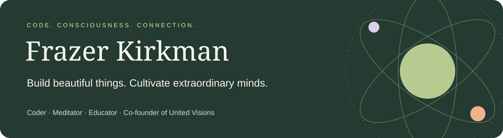

  <a href="https://frazerk.net/">Coaching & workshops</a> ·
  <a href="https://www.youtube.com/c/FrazerKirkman">YouTube</a> ·
  <a href="https://unitedvisions.org/">United Visions</a> ·
  <a href="https://www.facebook.com/frazerkirkman">Facebook</a> ·
  <a href="https://x.com/FrazerKirkman">X</a> ·
  <a href="https://www.instagram.com/frazerkirkman/">Instagram</a> ·
  <a href="https://www.linkedin.com/in/frazerkirkman">LinkedIn</a>

## Build beautiful things. Cultivate extraordinary minds.

I'm **Frazer**: a coder, meditator, and educator with Australian roots and a world-sized vision. I build technology that helps people, guide practices for a richer inner life, and bring humans together to make the world more compassionate, capable, and connected.

My north star: **humanity helping each other be awesome.**

### Code with a human purpose

I'm a senior software engineer at **Meta**, on the Reality Labs **Virtual Reality Component Library** Foundations team. I love turning worthwhile ideas into useful, delightful experiences. Earlier, I worked on **YouTube Live at Google** and **Otter.ai's web experience**.

I enjoy working with **React, TypeScript, Firebase, Unity, and VR**. My interests include educational apps, interactive mathematics and science, immersive learning, and humane productivity tools that help people act on what matters.

[Explore my repositories →](https://github.com/Frazer?tab=repositories) · [My programming contributions →](https://stackoverflow.com/users/3321725/frazer-kirkman)

### A mind worth coming home to

I guide **meditation, deep relaxation, visualization, and hypnotic autosuggestion**—self-directed suggestions for practising helpful attitudes and responses. My teaching invites people to explore blissful altered states and bring greater ease, happiness, confidence, and compassion into everyday life.

The aim is freedom from unnecessary suffering and stress, alongside more skill in the things we care about: learning, sport, art, work, and relationships. Notice your habits. Rehearse the response you want. Put it into practice.

Experiences vary; bliss and lasting change are possibilities to explore, not guaranteed outcomes.

### Learning that opens possibilities

I love mathematics, science, music, memory techniques, and the moment an idea clicks. I want children and adults to become curious, confident, independent thinkers—and to enjoy discovering what they can do.

My compass is **compassion and reality**: beliefs that answer to evidence, a willingness to question misconceptions and superstition, and the humility to keep learning.

## Listen, watch, explore

| Start here | What you'll find |
| --- | --- |
| [YouTube · Frazer Kirkman](https://www.youtube.com/c/FrazerKirkman) | Videos and live streams: meditation, ideas, and discovery. |
| [Deep sleep hypnosis & body scan](https://audio.com/frazerkirkman/audio/deep-sleep-hypnosis-body-scan-with-frazer-kirkman) | A 24-minute guided recording with suggestions for relaxation, peace, and sleep. |
| [My Audio.com recordings](https://audio.com/frazerkirkman) | My public audio profile. |
| [Mindful FIRE interview](https://podbay.fm/p/the-mindful-fire-podcast/e/1602560228) | A 77-minute conversation with Adam Coelho about brain programming, mindfulness, and intentional living. |
| [Watch the interview](https://www.youtube.com/watch?v=v5X6tx34hyg) | The Mindful FIRE conversation on YouTube. |
| [FrazerK.net](https://frazerk.net/) | Coaching, workshops, and participant reflections. |
| [United Visions](https://unitedvisions.org/) | The organisation I co-founded to help people flourish together. |
| [United Visions on YouTube](https://www.youtube.com/user/unitedvisionaries/) | The organisation's linked video channel. |

## A better inner world. A better shared world.

Through **United Visions**, I work toward a culture where every person has support to flourish, develop their abilities, and contribute their gifts. Where people support one another's dreams and work together on humanity's most worthwhile challenges—with greater skill, more beauty, and deeper connection.

Compassion includes other animals and the living world. **Veganism, nonviolence, and environmental care** are part of how I try to live those values. My [volunteering with the Earth Repair Foundation](https://frazerk.net/testimonial_img/EarthRepairReferenceForFrazer.pdf) is another expression of that commitment.

> “Frazer has a contagious joy that will lift any group.”
>
> — **Tom Butler-Bowdon**, author · [Published testimonial](https://frazerk.net/)

## Let's make something matter

I'd love to connect around **useful software, inspiring education, meditation workshops, and compassionate communities**.

[Facebook →](https://www.facebook.com/frazerkirkman) · [X →](https://x.com/FrazerKirkman) · [Instagram →](https://www.instagram.com/frazerkirkman/) · [Connect on LinkedIn →](https://www.linkedin.com/in/frazerkirkman)

---

About this repository

This is my GitHub profile repository. `README.md` appears on my GitHub profile; `index.html` is a responsive, standalone personal homepage with a small optional reflection interaction.

Open `index.html` directly in a browser, or serve this directory with `python3 -m http.server 8000`. There are no build tools, dependencies, tracking scripts, or external fonts. The artwork is local SVG; reduced-motion preferences are respected.

The HTML can be hosted on any static host. Adding it to this repository does not itself enable GitHub Pages.

Public links were researched in September 2026. Source notes are in [SOURCES.md](SOURCES.md).

